# Short description

Fully featured responsive web application to help coaches track and manage athletes and their progress. 
 It utilizes fatigue management features for predicting and auto-regulating training as well as training, body weight log, communication channels for program writing and coach-athlete relationship along with reports and graphs for easy insight in ongoing training and to help you progress better, plan your cycles and more. 
 Currently the application itself is open only to athletes who subscribe to training companion brand for coaching services. 
(Croatia)

V2 of application is in development with more expressive and intuitive UI, features like training program creator, chat, real-time feed, in-app notification and mail system, billing, dynamic real-time self-design dashboard, more robust and granular approach to exercises which adapts them to all kinds of sports. 

This readme will be updated soon to more comprehensive documentation and demo

For now you can see Kanban board here -> https://github.com/maranmaran/TrainingCompanion/projects/1

### Future architecture (in progress)
#### Microservices with bounded contexts
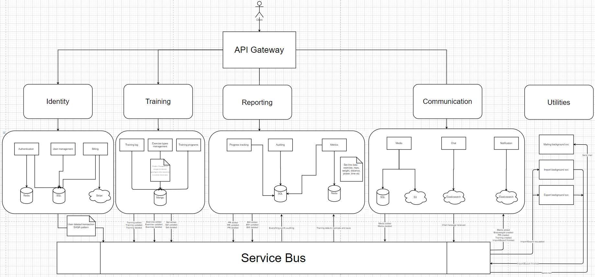
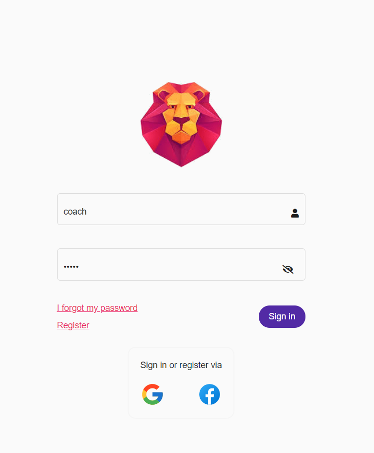
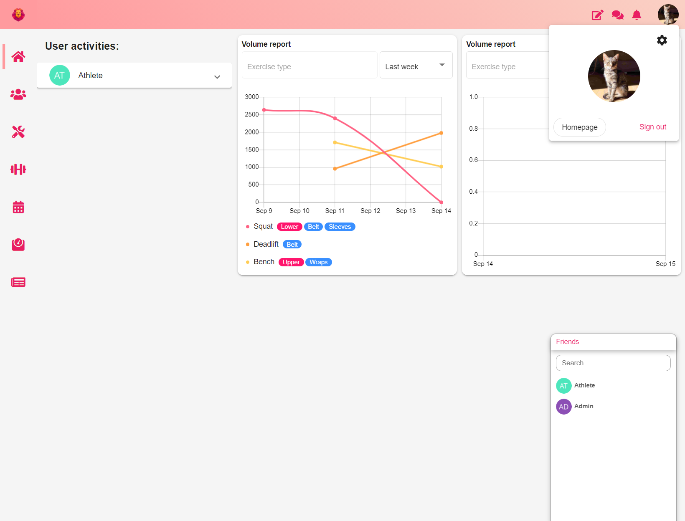
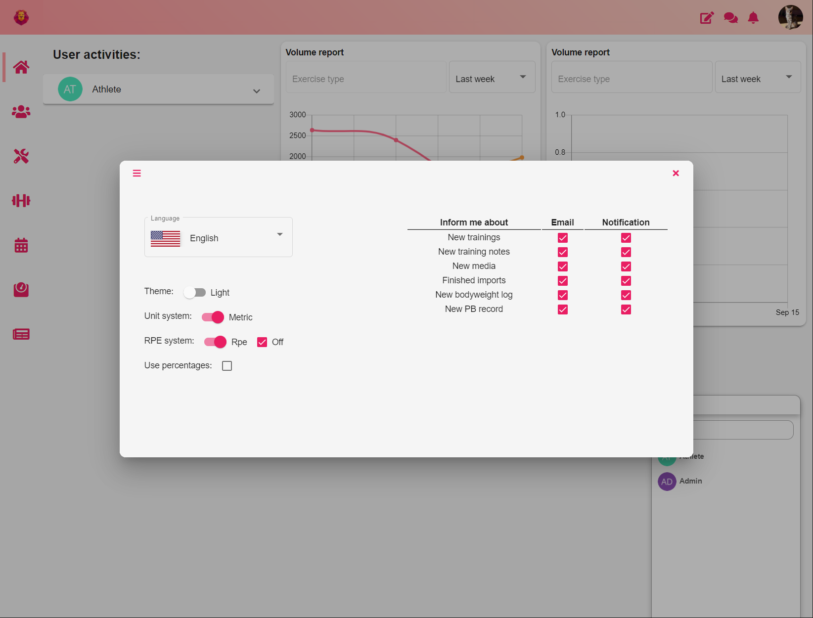
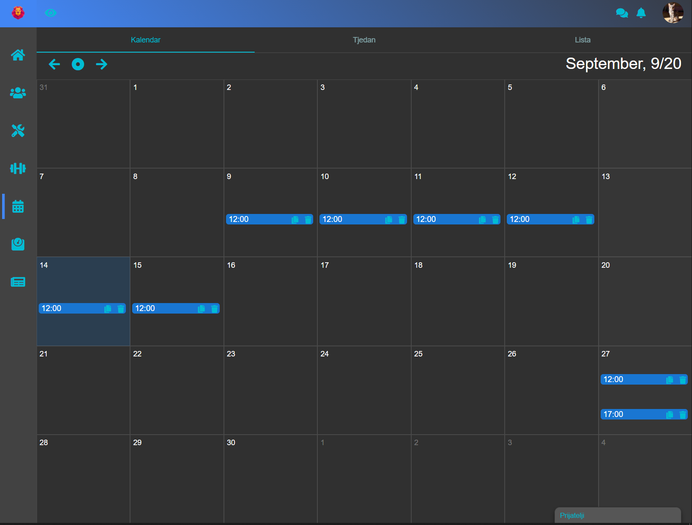
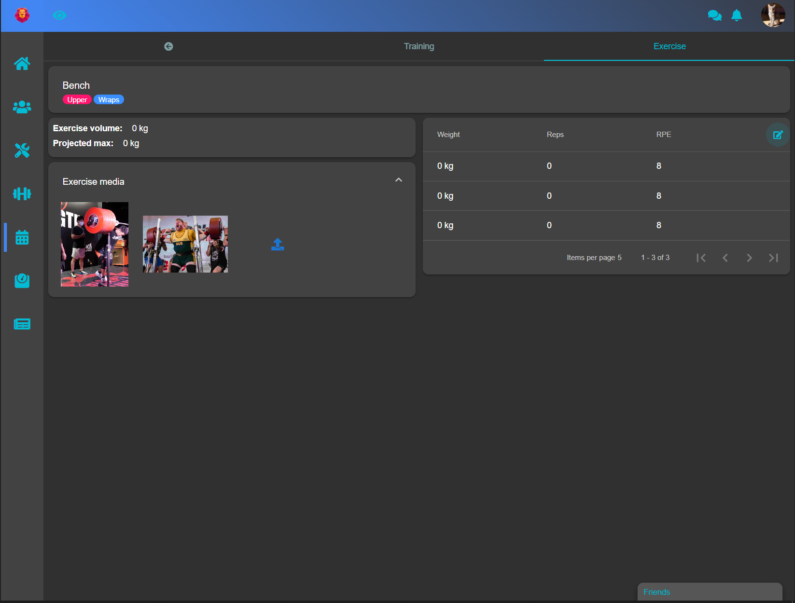
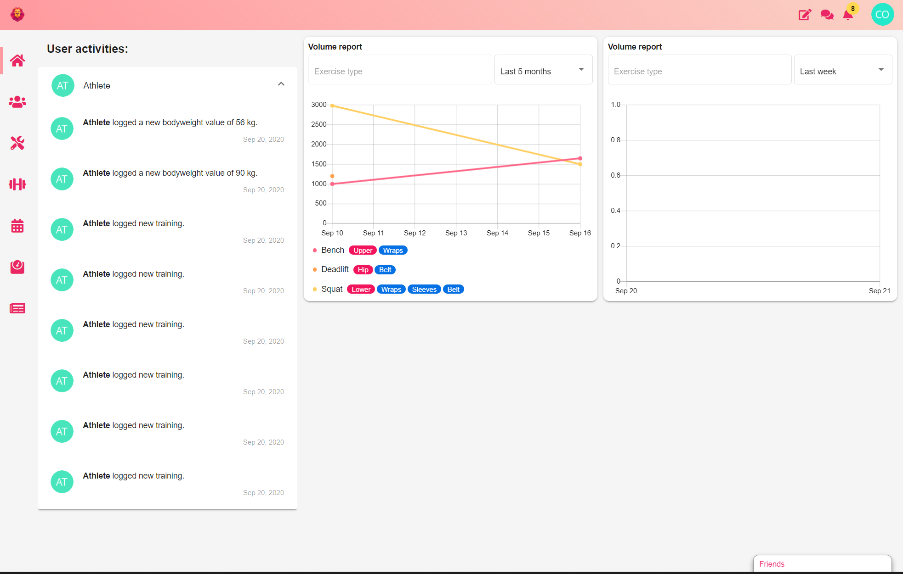
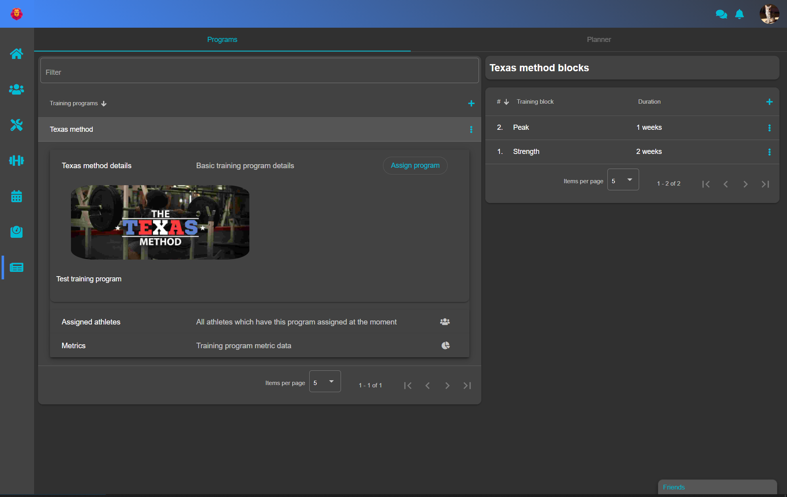
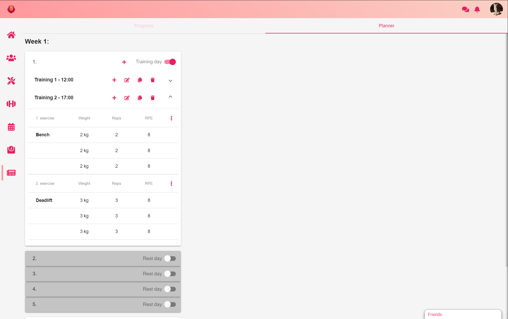
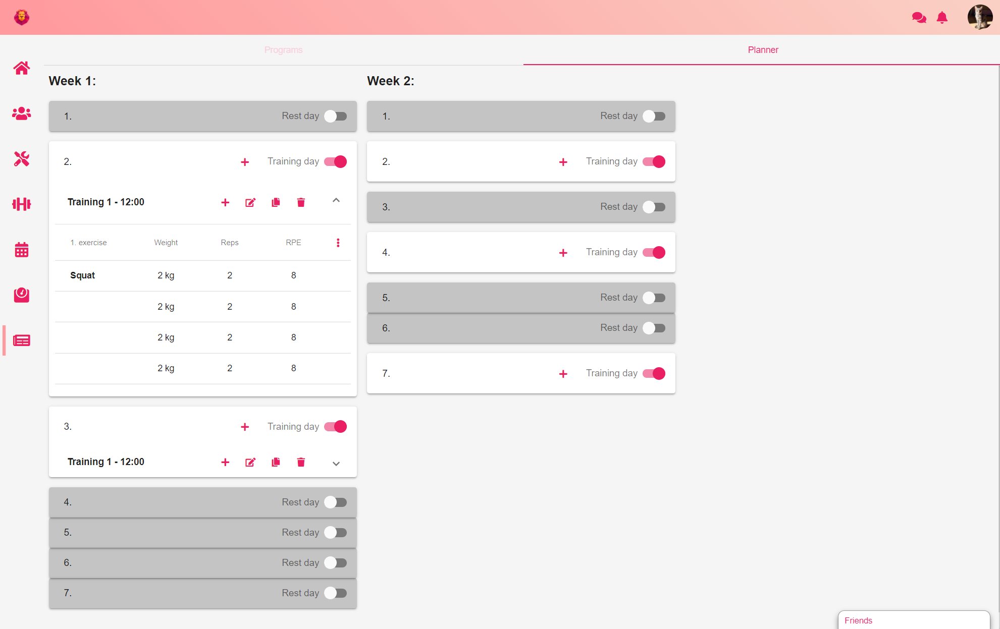
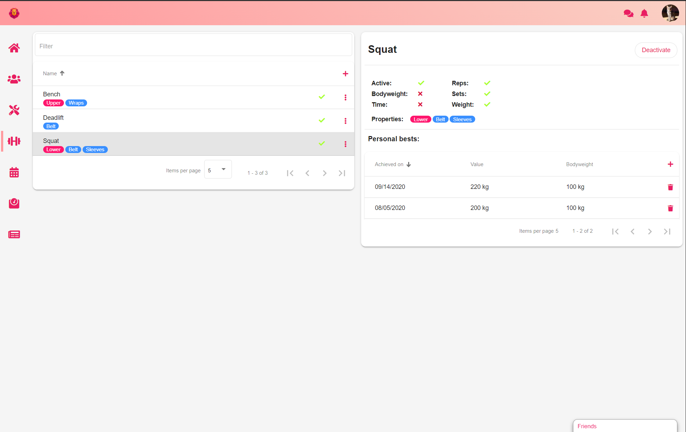
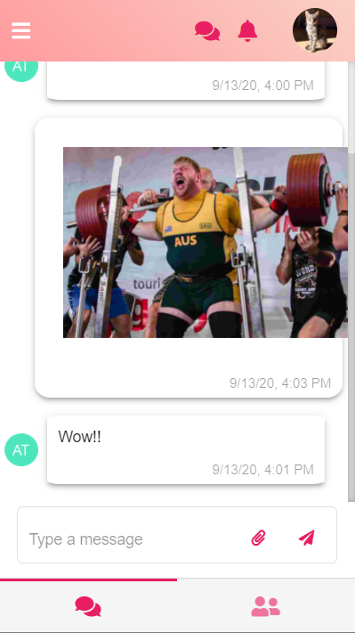
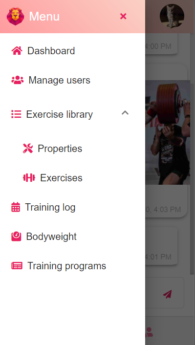
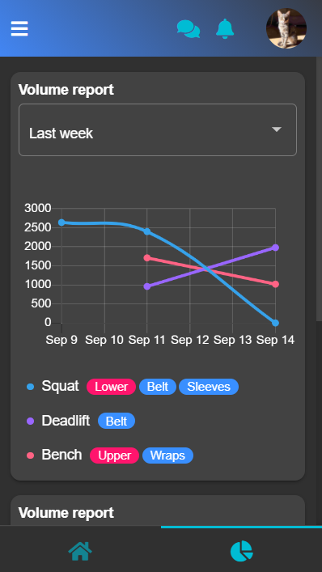
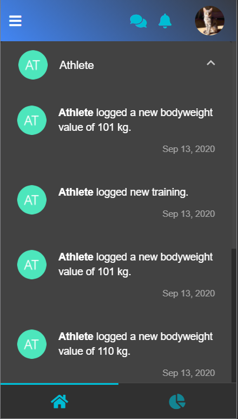
